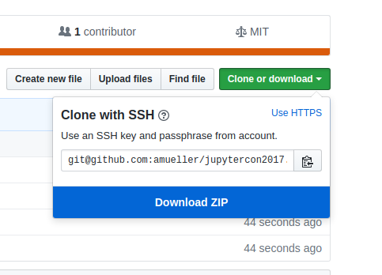

Data analysis and machine learning in Jupyter
=============================================


Instructor
-----------

- [Andreas Mueller](http://amuller.github.io) [@amuellerml](https://twitter.com/amuellerml) - Columbia University; [Introduction to Machine Learning with Python](http://shop.oreilly.com/product/0636920030515.do)


Obtaining the Tutorial Material
------------------


If you have a GitHub account, it is probably most convenient if you clone or
fork the GitHub repository. You can clone the repository by running:

```bash
git clone https://github.com/amueller/jupytercon2017.git

```

If you are not familiar with git or don’t have an
GitHub account, you can download the repository as a .zip file by heading over
to the GitHub repository (https://github.com/amueller/jupytercon2017) in
your browser and click the green “Download” button in the upper right.



Please note that we may add and improve the material until shortly before the
tutorial session, and we recommend you to update your copy of the materials one
day before the tutorials. If you have an GitHub account and cloned the
repository via GitHub, you can sync your existing local repository with:

```bash
git pull origin master
```

If you don’t have a GitHub account, you may have to re-download the .zip
archive from GitHub.


Installation Notes
------------------

This tutorial will require recent installations of

- [NumPy](http://www.numpy.org)
- [SciPy](http://www.scipy.org)
- [matplotlib](http://matplotlib.org)
- [pandas](http://pandas.pydata.org)
- [pillow](https://python-pillow.org)
- [scikit-learn](http://scikit-learn.org/stable/)
- [IPython](http://ipython.readthedocs.org/en/stable/)
- [Jupyter Notebook](http://jupyter.org)


The last one is important, you should be able to type:

    jupyter notebook

in your terminal window and see the notebook panel load in your web browser.
Try opening and running a notebook from the material to see check that it works.

For users who do not yet have these  packages installed, a relatively
painless way to install all the requirements is to use a Python distribution
such as [Anaconda CE](http://store.continuum.io/ "Anaconda CE"), which includes
the most relevant Python packages for science, math, engineering, and
data analysis; Anaconda can be downloaded and installed for free
including commercial use and redistribution.
The code examples in this tutorial should be compatible to Python 2.7,
Python 3.4-3.6.

After obtaining the material, we **strongly recommend** you to open and execute
the Jupyter Notebook `jupter notebook check_env.ipynb` that is located at the
top level of this repository. Inside the repository, you can open the notebook
by executing

```bash
jupyter notebook check_env.ipynb
```

inside this repository. Inside the Notebook, you can run the code cell by
clicking on the "Run Cells" button as illustrated in the figure below:


Finally, if your environment satisfies the requirements for the tutorials, the
executed code cell will produce an output message as shown below:


Although not required, we also recommend you to update the required Python
packages to their latest versions to ensure best compatibility with the
teaching material. Please upgrade already installed packages by executing

- `pip install [package-name] --upgrade`  
- or `conda update [package-name]`


Outline
=======
t.b.a.

